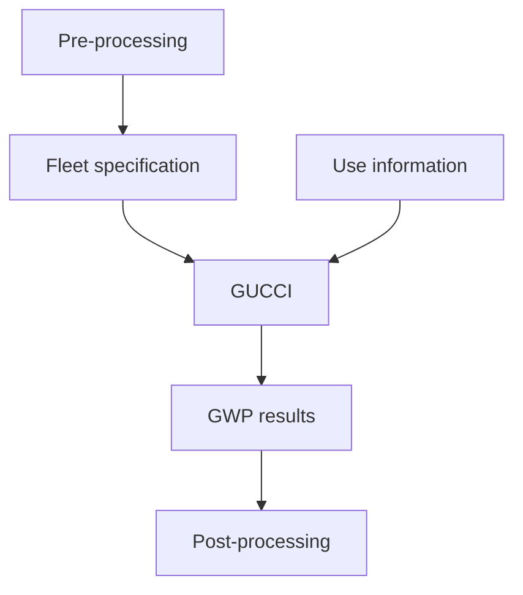

# Gas Use: Calculator for Climate Impact (GUCCI)

## Overview

The calculator takes as input information about _gases_ and their _uses_, along with information about how many instances of each use occur over time. Gases of interest might include hydrofluorocarbons, and the relevant information about each gas includes its global warming potential (GWP), measured as tons of carbon dioxide emission equivalent. Uses include devices like refrigerators, which have certain amounts of gas contained in them when first manufactured and then emit amounts of that gas into the atmosphere over time, as well as transient uses, that immediately release the gases into the atmosphere.

The output of the calculator is the amount of each gas used, the amount contained within the device uses, and the GWP of the emitted gases. Each of these quantities is time-resolved.

## Calculator structure

### Gases

- Gases and their characteristics can be specified in a single user input file.
- In the code, a _gas data manager_ object provides multiple functions:
  - Manages information about the gases, returning relevant information about gases when queried
  - Tracks the quantities of each gas contained in devices or emitted
  - Computes the GWP of emitted gases

### Uses

- Uses and their characteristics can be specified in a single user input file.
- Uses are subdivided into _devices_ and _transient uses_. Transient uses immediately emit their relevant gases; devices contain gases and emit them over time.
- Devices further subdivide by the format of their time-dependent emissions. E.g., some devices might fail suddenly and release all their gas; others might emit according to an exponential decay as per [Fick's law](https://en.wikipedia.org/wiki/Fick%27s_laws_of_diffusion).
- In the code, use information is managed by a _use data manager_ object that returns relevant information about uses when queried.

### Fleet

- In analogy to cars, the time-varying quantity and composition of uses is called the _fleet_.
- The fleet can be specified in a single human- and machine-readable file.
- In the code, the fleet is an object that tracks the quantities of the uses through time.

### Workflow

1. Users specify one or more fleets in pre-processing steps.
2. The calculator is run on each fleet specification.
3. Post-processing scripts collate those results for further analysis.

## Open questions

- How to deal with different timescales of GWPs (e.g., methane has GWP-20 of 81.2 but GWP-100 of 27.9)
